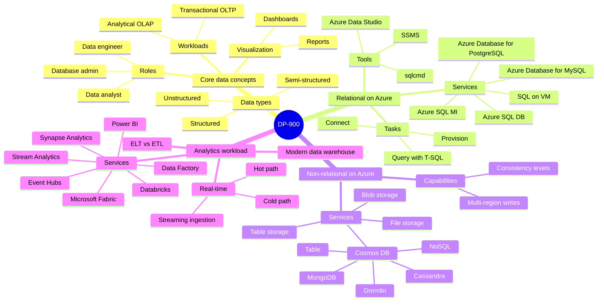
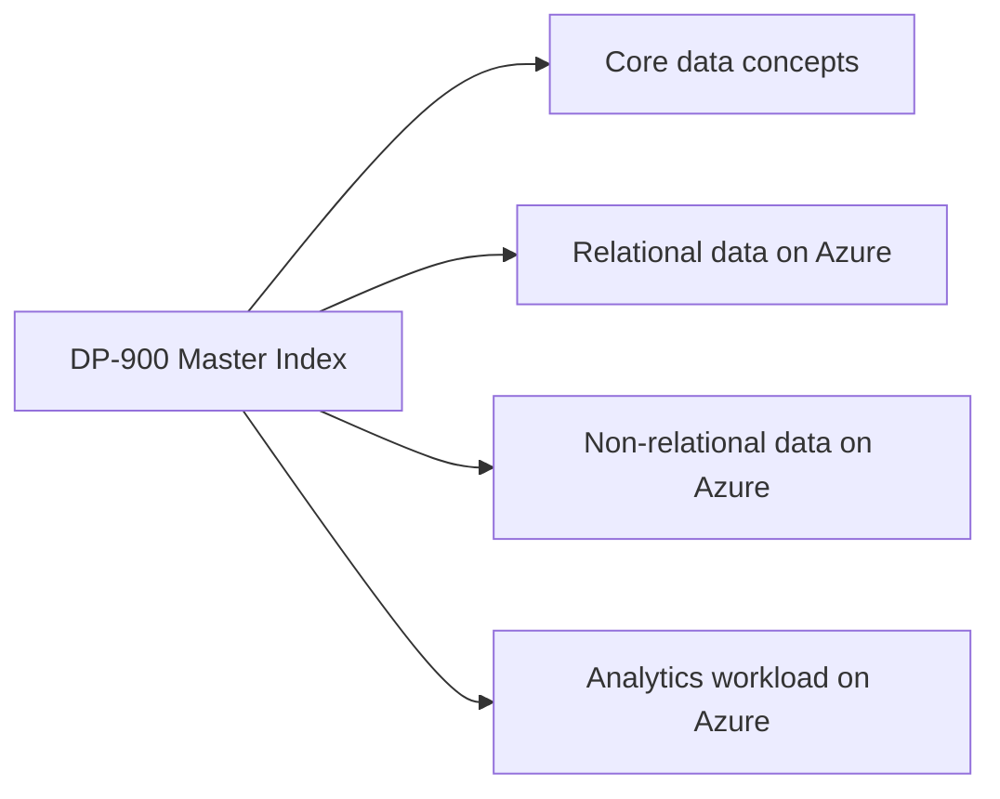
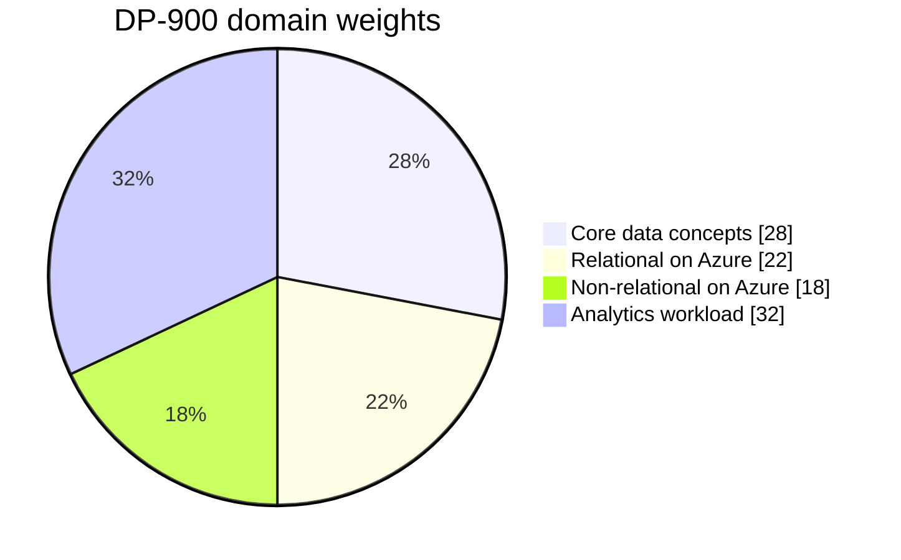

# DP-900 - Azure Data Fundamentals - Visual Study Guide

> Concept-only study aid. No exam questions reproduced. Source PDF (if any) stays local + gitignored.

**Skills outline:** https://learn.microsoft.com/credentials/certifications/resources/study-guides/dp-900

> [!NOTE]
> DP-900 is a **fundamentals** exam. Focus on concepts and Azure service mapping - not deep T-SQL or KQL syntax.

## Master mind map

## Domain map

## Domain weights

## Recommended study order

```mermaid
gantt
    title Suggested study plan
    dateFormat X
    axisFormat Day %d
    section Plan
    Core concepts          :t1, 0, 2d
    Relational on Azure    :t2, after t1, 2d
    Non-relational         :t3, after t2, 2d
    Analytics              :t4, after t3, 2d
    Cheatsheet review      :t5, after t4, 1d
```

---

**Next:** open [01-core-data-concepts.md](01-core-data-concepts.md)
