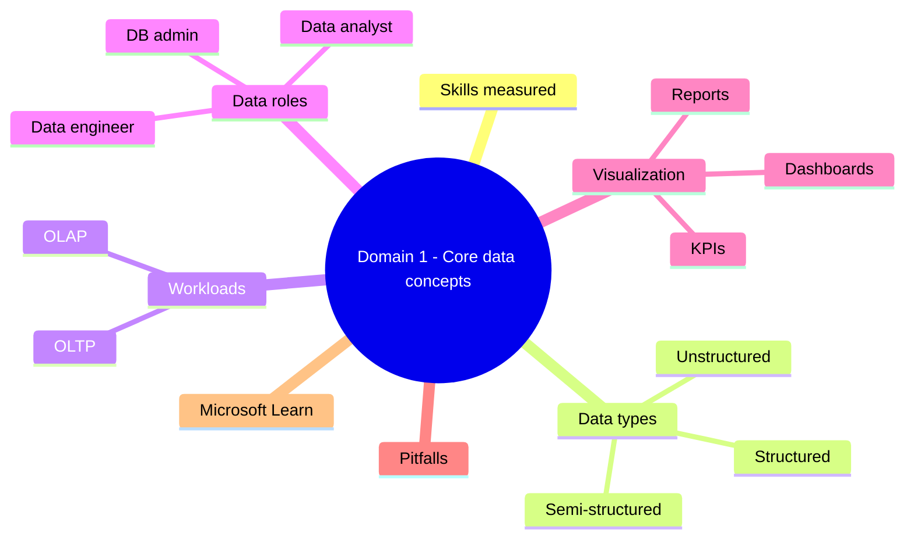
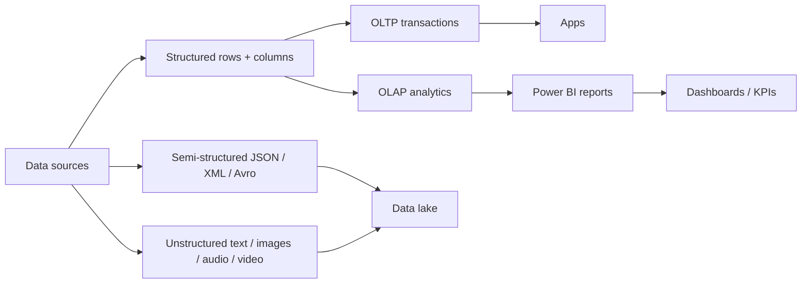

# Domain 1: Core Data Concepts

> Vocabulary and patterns every data role needs - independent of any service.

## Domain mind map

## Skills measured

- Identify data types: structured, semi-structured, unstructured.
- Distinguish OLTP vs OLAP workloads.
- Know responsibilities of database administrator, data engineer, data analyst.
- Identify common data visualization techniques (reports, dashboards, KPIs).

## Concept map

## Decision reference

| Need | Pick |
|---|---|
| Customer order with 50 rows / sec | OLTP relational (Azure SQL DB) |
| Aggregate sales over years | OLAP analytics (Fabric Warehouse / Synapse) |
| Tweets, photos, PDFs | Unstructured -> blob storage / data lake |
| Product JSON catalog with varying fields | Semi-structured -> Cosmos DB / JSON column |
| Pixel-perfect printable report | Power BI **paginated report** |
| Live ops view with KPIs and tiles | Power BI **dashboard** |

## Data types

- **Structured**: fixed schema, rows + columns. Tables in Azure SQL, PostgreSQL, MySQL.
- **Semi-structured**: schema-on-read; JSON / XML / Avro / Parquet. Cosmos DB, Azure Table storage, JSON columns.
- **Unstructured**: no internal schema; text, images, audio, video. Blob storage, Data Lake.

## OLTP vs OLAP

| Trait | OLTP | OLAP |
|---|---|---|
| Workload | Many small transactions | Few large queries |
| Schema | Normalized | Denormalized / star schema |
| Latency | ms | seconds-minutes |
| Examples | Azure SQL DB, Cosmos DB | Fabric Warehouse, Synapse, Databricks |

## Data roles

- **Database administrator (DBA)**: install, secure, back up, tune databases.
- **Data engineer**: ingest, transform, build pipelines and lakes.
- **Data analyst**: model, visualize, deliver insights via Power BI.

Note overlap: a Fabric / Power BI developer may wear all three hats in a small org.

## Visualization techniques

- **Report** = static / paginated detail document.
- **Dashboard** = curated live tiles for monitoring.
- **KPI** = single metric vs target.
- **Charts** = bar, line, scatter, map - pick by question type.

## Common pitfalls

- Treating semi-structured JSON like unstructured -> miss easy queries.
- Mixing OLTP + OLAP in same DB without isolation -> lock contention.
- Confusing dashboard (Power BI service) with report (Power BI Desktop).
- Calling roles interchangeable - they have distinct accountabilities.

## Microsoft Learn

- [Explore core data concepts](https://learn.microsoft.com/training/paths/azure-data-fundamentals-explore-core-data-concepts/)
- [Data analytics roles](https://learn.microsoft.com/training/modules/explore-roles-responsibilities-world-of-data/)
- [Visualization in Power BI](https://learn.microsoft.com/training/modules/visualize-data-power-bi/)

---

**Next:** [02-relational-data.md](02-relational-data.md)
