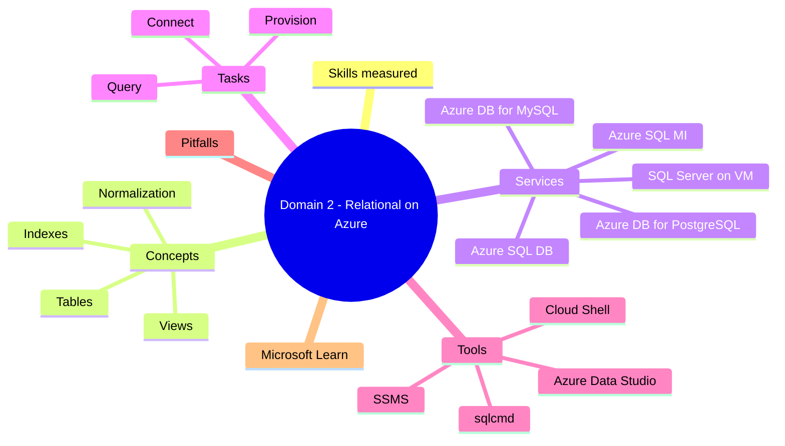
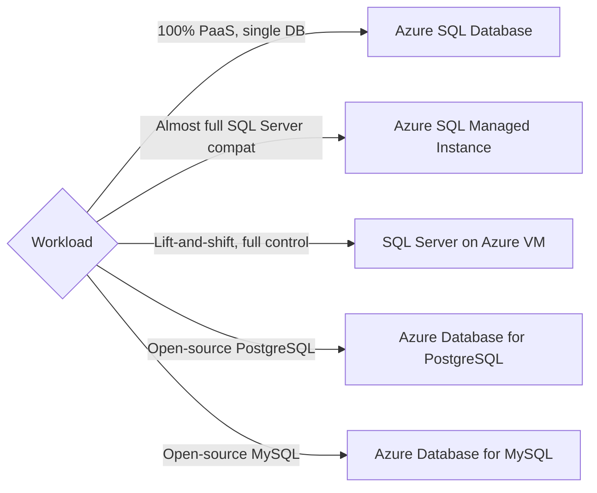

# Domain 2: Relational Data on Azure

> Azure relational services and the basics of provisioning and querying.

## Domain mind map



## Skills measured

- Identify relational concepts: tables, rows, columns, primary key, foreign key, index, view, normalization.
- Map workloads to Azure relational services.
- Identify provisioning and connection options.
- Recognize basic T-SQL: SELECT, INSERT, UPDATE, DELETE, JOIN.

## Concept map



## Decision reference

| Need | Pick |
|---|---|
| Brand-new cloud-native app | Azure SQL Database |
| Lift-and-shift many on-prem DBs with cross-DB queries / SQL Agent | Azure SQL Managed Instance |
| Need root access / 3rd-party agents on the SQL host | SQL Server on Azure VM |
| App written for PostgreSQL | Azure Database for PostgreSQL |
| App written for MySQL | Azure Database for MySQL |

## Relational concepts (refresher)

- **Table**: rows (records) + columns (fields).
- **Primary key**: unique identifier per row.
- **Foreign key**: enforces relationship to another table.
- **Index**: accelerates lookup; trade write cost.
- **View**: virtual table from a query.
- **Normalization**: 1NF/2NF/3NF reduce redundancy.

## Azure relational services

| Service | Tier | Best for |
|---|---|---|
| **Azure SQL Database** | PaaS DB | Cloud-native apps; pay per DB or pool |
| **Azure SQL Managed Instance** | PaaS instance | Lift-and-shift; cross-DB queries; SQL Agent |
| **SQL Server on Azure VM** | IaaS | Full OS control |
| **Azure Database for PostgreSQL** | PaaS (Flexible Server) | OSS Postgres |
| **Azure Database for MySQL** | PaaS (Flexible Server) | OSS MySQL |

## Provisioning + connect

- **Provisioning**: portal, ARM/Bicep, Terraform, CLI, PowerShell.
- **Auth**: SQL auth or Microsoft Entra ID auth.
- **Firewall**: public IP rules or **Private Endpoint** + VNet integration.
- **Connect tools**: SSMS, Azure Data Studio, `sqlcmd`, Power BI, Cloud Shell.

## Basic T-SQL

```sql
SELECT FirstName, LastName FROM Customers WHERE City = 'Seattle';
INSERT INTO Customers (FirstName, LastName) VALUES ('Ada', 'Lovelace');
UPDATE Customers SET City = 'NYC' WHERE Id = 42;
DELETE FROM Customers WHERE Id = 42;
SELECT c.Name, o.Total FROM Customers c JOIN Orders o ON c.Id = o.CustomerId;
```

## Common pitfalls

- Choosing Azure SQL DB when cross-DB queries needed -> should have picked Managed Instance.
- Forgetting firewall rule on Azure SQL DB -> connection refused.
- Putting OLAP queries on the OLTP DB -> blocking + bad plans.
- Picking SQL VM when PaaS would suffice -> avoidable patch / backup work.

## Microsoft Learn

- [Explore relational data services](https://learn.microsoft.com/training/paths/azure-data-fundamentals-explore-relational-data/)
- [Azure SQL families](https://learn.microsoft.com/azure/azure-sql/azure-sql-iaas-vs-paas-what-is-overview)
- [PostgreSQL Flexible Server](https://learn.microsoft.com/azure/postgresql/flexible-server/overview)

---

**Next:** [03-non-relational-data.md](03-non-relational-data.md)
