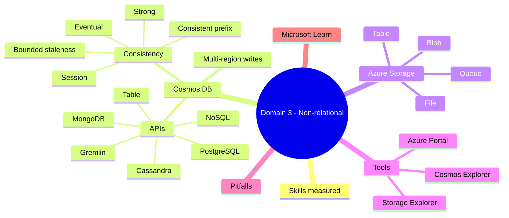
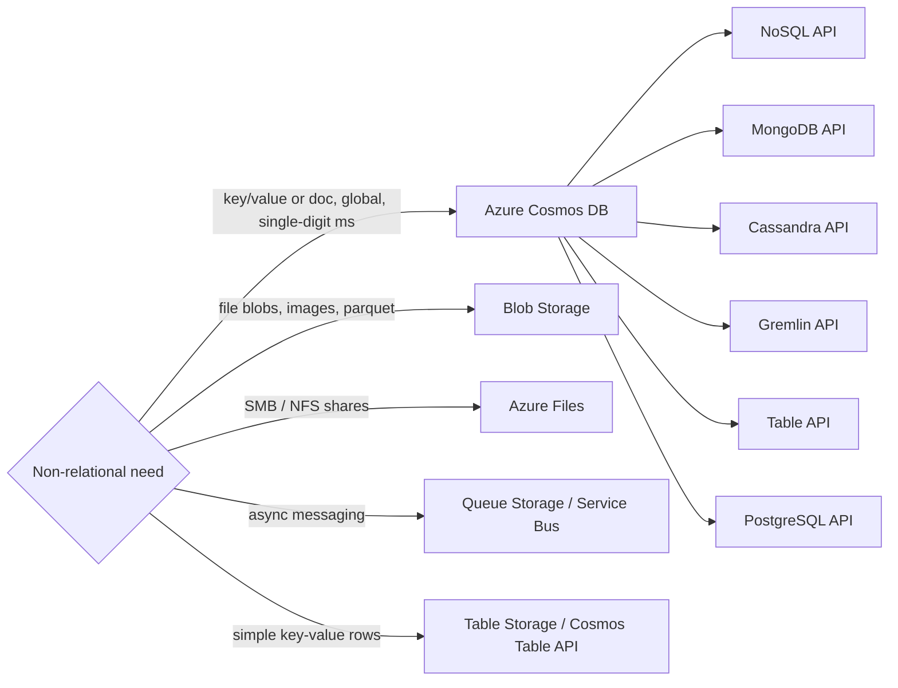

# Domain 3: Non-Relational Data on Azure

> Cosmos DB and Azure Storage families.

## Domain mind map

## Skills measured

- Identify non-relational data scenarios.
- Map workloads to Cosmos DB APIs and Azure Storage services.
- Identify Cosmos DB consistency levels.
- Provision and connect to non-relational services.

## Concept map

## Decision reference

| Need | Pick |
|---|---|
| Globally distributed JSON documents | Cosmos DB **NoSQL** API |
| Existing MongoDB app -> Azure | Cosmos DB **MongoDB** API |
| Cassandra workloads | Cosmos DB **Cassandra** API |
| Graph (vertices + edges) | Cosmos DB **Gremlin** API |
| Sharded PostgreSQL | Cosmos DB for **PostgreSQL** (Citus) |
| Large file objects, parquet, video | Blob Storage |
| Lift-and-shift SMB share | Azure Files |
| Async producer / consumer | Queue Storage (or Service Bus for advanced) |
| Simple flat key-value rows | Table Storage |

## Cosmos DB APIs

- **NoSQL** (formerly SQL API): native JSON; SQL-like query language. Recommended for new workloads.
- **MongoDB** (RU and vCore): wire-compatible.
- **Cassandra**: CQL-compatible.
- **Gremlin**: Apache TinkerPop graph traversal.
- **Table**: drop-in upgrade from Azure Table storage.
- **PostgreSQL**: distributed Postgres (Citus).

## Cosmos DB consistency levels

From strongest to weakest:

1. **Strong** - linearizable; only single-region writes.
2. **Bounded staleness** - lag bounded by K versions or time.
3. **Session** (default) - read-your-own-writes per session.
4. **Consistent prefix** - reads never see out-of-order writes.
5. **Eventual** - lowest latency; no order guarantees.

## Azure Storage families

- **Blob storage**: object store. Tiers: Hot, Cool, Cold, Archive.
  - Containers + blobs; supports lifecycle management.
  - **Azure Data Lake Storage Gen2** = blob storage with hierarchical namespace + ACLs.
- **File storage (Azure Files)**: SMB/NFS shares; mount as drive.
- **Queue storage**: simple async messaging (~64 KB messages).
- **Table storage**: NoSQL key-value rows; cheap; superseded by Cosmos Table API.

## Provision + connect

- Provisioning: portal, ARM/Bicep, CLI.
- Auth: account keys, SAS tokens, **Microsoft Entra ID** (preferred), Managed Identity.
- Tools: Storage Explorer, Cosmos DB Explorer, Azure Portal Data Explorer.

## Common pitfalls

- Picking Strong consistency in a globally-distributed app -> can't multi-region write.
- Using Table storage for new workloads -> Cosmos DB Table API is usually the choice.
- Storing tiny JSON docs in Blob storage -> use Cosmos for indexing.
- Confusing Azure Files (SMB share) with Blob (object store).
- Forgetting hot/cool/cold/archive trade-offs (archive has hours of rehydration latency).

## Microsoft Learn

- [Cosmos DB consistency levels](https://learn.microsoft.com/azure/cosmos-db/consistency-levels)
- [Choose the right Cosmos DB API](https://learn.microsoft.com/azure/cosmos-db/choose-api)
- [Storage account overview](https://learn.microsoft.com/azure/storage/common/storage-account-overview)
- [Blob access tiers](https://learn.microsoft.com/azure/storage/blobs/access-tiers-overview)

---

**Next:** [04-analytics-workload.md](04-analytics-workload.md)
