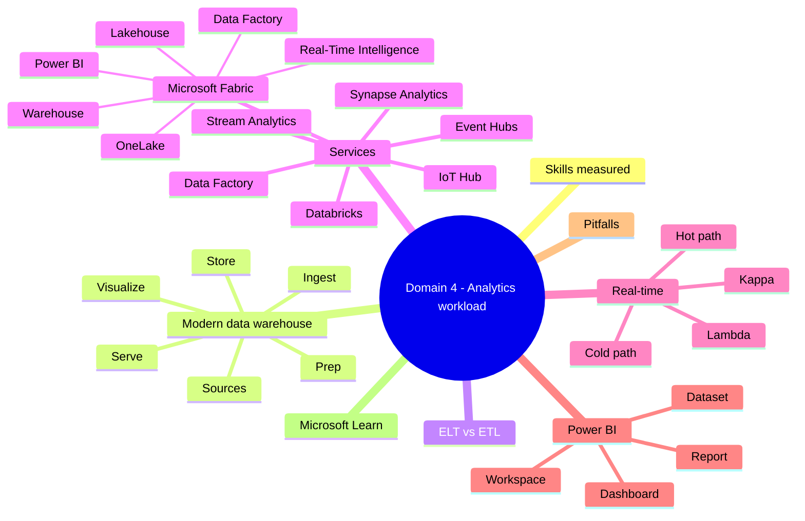
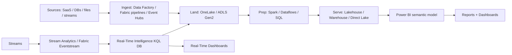

# Domain 4: Analytics Workload on Azure

> Modern data warehouse, batch / streaming, Microsoft Fabric, and Power BI.

## Domain mind map

## Skills measured

- Describe the modern data warehouse architecture.
- Identify ELT vs ETL.
- Map workloads to Fabric, Synapse, Databricks, Data Factory, Stream Analytics, Power BI.
- Recognize Power BI workspace / dataset / report / dashboard.

## Concept map

## Decision reference

| Need | Pick |
|---|---|
| End-to-end SaaS analytics platform | Microsoft Fabric |
| Big-data Spark workloads (open-source) | Azure Databricks |
| Dedicated MPP SQL warehouse | Synapse dedicated SQL pool / Fabric Warehouse |
| Code-free pipelines + ETL | Azure Data Factory or Fabric Data Factory |
| Event ingestion at scale | Event Hubs / IoT Hub / Fabric Eventstream |
| Real-time SQL on streaming data | Stream Analytics or Fabric KQL DB |
| Time-series IoT analytics | Real-Time Intelligence (Fabric) / ADX |
| Self-service BI reports | Power BI Desktop -> Service |
| Pixel-perfect printable report | Power BI **paginated** report |
| Live tile dashboard | Power BI **dashboard** |

## Modern data warehouse pattern

1. **Ingest** raw sources (batch or streaming).
2. **Land** in raw zone (data lake / OneLake).
3. **Prep / curate** with Spark / SQL / dataflows.
4. **Serve** in warehouse / lakehouse / semantic model.
5. **Visualize** in Power BI.

## ELT vs ETL

- **ETL**: Extract -> Transform (in tool) -> Load (into target). Older pattern; transform engine is the bottleneck.
- **ELT**: Extract -> Load (into target) -> Transform (in target's engine). Modern; uses target's massively parallel compute (Fabric Warehouse, Synapse, Databricks).

## Microsoft Fabric

- SaaS unified analytics: **OneLake** (single storage), **Lakehouse**, **Warehouse**, **Data Factory**, **Real-Time Intelligence**, **Power BI** all in one product.
- **Direct Lake** mode: Power BI reads parquet in OneLake without import.
- **Capacity** (F SKU): shared compute pool across all workloads.

## Real-time

- **Hot path** (low-latency): Event Hubs / IoT Hub -> Stream Analytics or Fabric Eventstream -> dashboard.
- **Cold path** (batch): same data lands in lake for next-day batch processing.
- **Lambda**: hot + cold paths combined.
- **Kappa**: streaming-only (one path).

## Power BI

- **Workspace**: collaboration container.
- **Semantic model (dataset)**: data + measures + relationships.
- **Report**: pages of visuals (Desktop or Service).
- **Dashboard**: pinned tiles in the Service for monitoring.
- **Paginated report**: pixel-perfect, printable; built in Report Builder.

## Common pitfalls

- Picking Synapse dedicated SQL pool for ad-hoc small-team analytics -> Fabric is usually simpler.
- Confusing dashboard with report.
- Doing transforms in Power BI for huge data instead of pushing to Spark / Warehouse.
- Stream Analytics vs Fabric Eventstream: pick one, not both for the same hop.
- Forgetting Direct Lake requires OneLake parquet (not arbitrary parquet anywhere).

## Microsoft Learn

- [What is Microsoft Fabric](https://learn.microsoft.com/fabric/get-started/microsoft-fabric-overview)
- [Modern data warehouse](https://learn.microsoft.com/azure/architecture/example-scenario/dataplate2e/data-platform-end-to-end)
- [Stream Analytics](https://learn.microsoft.com/azure/stream-analytics/)
- [Power BI for analysts](https://learn.microsoft.com/training/paths/get-started-data-analyze-power-bi/)

---

**Next:** [05-exam-cheatsheet.md](05-exam-cheatsheet.md)
