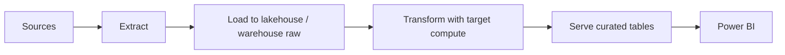
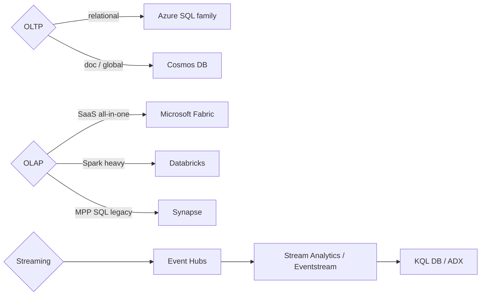

# DP-900 Extra Concepts

> Subtle distinctions that show up in exam wording.

## Storage tier comparison

| Tier | Min duration | Access cost | Storage cost | Use |
|---|---|---|---|---|
| Hot | None | Lowest | Highest | Frequently accessed |
| Cool | 30 days | Higher | Lower | Infrequent (monthly) |
| Cold | 90 days | Higher | Lower than Cool | Rarely (quarterly) |
| Archive | 180 days | Highest + rehydrate hours | Lowest | Compliance / archive |

## Fabric vs Synapse vs Databricks

| Aspect | Fabric | Synapse | Databricks |
|---|---|---|---|
| Hosting | SaaS | PaaS | PaaS partner-managed |
| Storage | OneLake (default) | ADLS Gen2 | ADLS / Unity Catalog |
| Compute | F-SKU shared | Dedicated SQL + Spark | Spark + Photon |
| BI | Power BI built-in | Power BI external | Power BI external |
| Best for | All-in-one | MPP SQL + Spark | Heavy Spark / ML |

## ELT pattern (modern data warehouse)

## Cosmos DB consistency trade-off

| Level | Latency | Throughput | Multi-region writes |
|---|---|---|---|
| Strong | Highest | Lowest | No |
| Bounded staleness | High | Low | Yes |
| Session | Mid | Mid | Yes |
| Consistent prefix | Low | High | Yes |
| Eventual | Lowest | Highest | Yes |

## Power BI artifact lineage

| Artifact | Where authored | Where consumed |
|---|---|---|
| Semantic model (dataset) | Desktop / Service | Power BI Service |
| Report | Desktop / Service | Service / Mobile / Embedded |
| Dashboard | Service | Service / Mobile |
| Paginated report | Report Builder | Service |
| Dataflow / Datamart | Service | Service |

## Service map at a glance

---

[Master Index](00-MASTER-INDEX.md)
