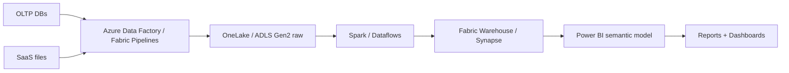
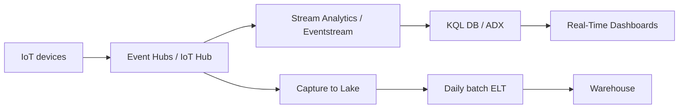
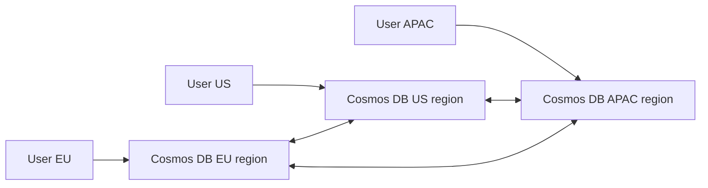
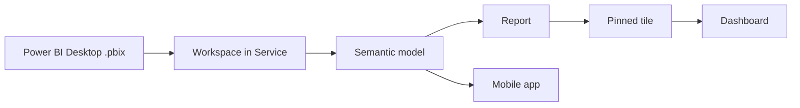

# DP-900 Reference Architectures

> Foundational data architecture shapes you should recognize.

## 1. Modern data warehouse

## 2. Real-time analytics (lambda)

## 3. Cosmos DB globally distributed app

## 4. Power BI publishing flow

## 5. Azure Storage tier lifecycle

---

[Master Index](00-MASTER-INDEX.md)
